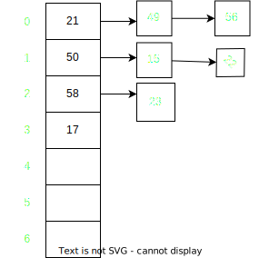

 1. If we know the key in advance, then we can <b>Perfect hashing</b>.
 2. If we do don't know the keys, then we use one of the following

## Chaining

hash(key) = key % 7  
keys ={50, 21, 58, 17, 15, 49, 56, 22, 23, 25}

## Performance
m = No of slots in hash table
n = No of keys to be inserted

Load factor alpha