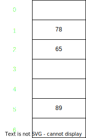
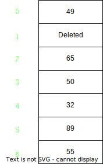

# Open Addressing 

<strong>Points to Remember</strong> 

    1. No of slots in hash table >= No of keys to be inserted
    2. Cache friendly
    3. Open addressing uses only single array to store the set of keys

# Ways of hashing

    1. Linear probing hashing
    2. Quadratic hashing
    3. Double hashing

### Open Addressing Example  ==> 

values = [65,89,78,55,32,49,50]; m = 7;

int key = values[0] % m = 65 % 7 = 2;  
int key = values[1] % m = 89 % 7 = 5;  
int key = values[2] % m = 78 % 7 = 1;  
int key = values[3] % m = 55 % 7 = 6;  
int key = values[4] % m = 32 % 7 = 4;  
int key = values[5] % m = 49 % 7 = 0;  
int key = values[6] % m = 50 % 7 = 1; [ collision ]  
Here collision occurred so find a key using modulo operator where slot is empty and if same key reached then array is full so
key = (values[6] + 1) % m = 51 % 7 = 2 [ again collision ]
key = (values[6] + 2) % m = 52 % 7 = 3; empty slot found so just insert values[6] in this slot

## How to handle deleted scenarios

delete 78 from array  
find key of 78
int key = 78 % 7 = 1 
add Deleted at key 1 

Adding deleted will allow us to find element from entire array else keeping it empty search might stop before searching into the entire array

## What if entire array is filled and item is not present

==> check the condition if hashed key is not same as it was in initially if it is then stop else keep searching the item in the array

## 

